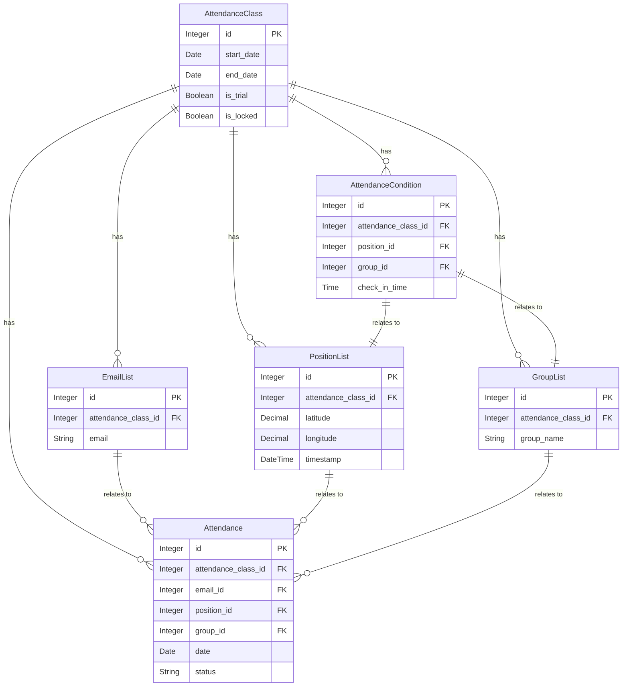

```mermaid
erDiagram
    AttendanceClass {
        Integer id PK
        Date start_date
        Date end_date
        Boolean is_trial
        Boolean is_locked
    }

    EmailList {
        Integer id PK
        Integer attendance_class_id FK
        String email
    }
    
    PositionList {
        Integer id PK
        Integer attendance_class_id FK
        Decimal latitude
        Decimal longitude
        DateTime timestamp
    }

    GroupList {
        Integer id PK
        Integer attendance_class_id FK
        String group_name
    }

    AttendanceCondition {
        Integer id PK
        Integer attendance_class_id FK
        Integer position_id FK
        Integer group_id FK
        Time check_in_time
    }

    Attendance {
        Integer id PK
        Integer attendance_class_id FK
        Integer email_id FK
        Integer position_id FK
        Integer group_id FK
        Date date
        String status
    }

    AttendanceClass ||--o{ EmailList: "has"
    AttendanceClass ||--o{ PositionList: "has"
    AttendanceClass ||--o{ GroupList: "has"
    AttendanceClass ||--o{ AttendanceCondition: "has"
    AttendanceCondition ||--|| PositionList: "relates to"
    AttendanceCondition ||--|| GroupList: "relates to"
    AttendanceClass ||--o{ Attendance: "has"
    EmailList ||--o{ Attendance: "relates to"
    PositionList ||--o{ Attendance: "relates to"
    GroupList ||--o{ Attendance: "relates to"
```